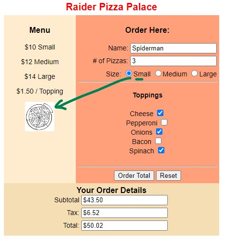
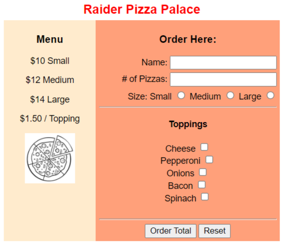

# JS-Pizza-Form

## Instructions

- Add all the checkbox, radio buttons and inputs needed.

- When **Order Total** is pressed: Display the ‘details’ div. Show the calculated subtotal, tax and total.

- When the **Size** radio button is chosen for the pizza: Change the image height to match (small = 60px, medium = 80px, large = 100px)

- When **Reset** is pressed: Reset the values in the order to __blank__ and also **hide** the order ‘details’ div, change pizza img back to medium size (or invisible).

# Markscheme (18 marks)

## /5 - Build HTML Elements

- Input Number of Pizzas
- Radio buttons (three sizes)
- Checkboxes (five or more Toppings)
- Button - Order Total
- Button - Reset

## /2 - Size Selection

- Radio button OnClick event listener
- Change height of image to match

## /7 - Function Order Total

- Button onclick event listener
- Display Details Div
- Get Number of Pizzas
- Get Pizza Size
- Get Number of Toppings
- Calculate subtotal, tax and total
- Display subtotal, tax and total to screen

## /4 - Function Reset Order

- Button onclick event listener
- Clear Options (# pizzas, radio buttons, checkboxes)
- Hide Details Div
- Pizza Image back to Medium (or invisible)

