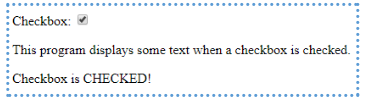
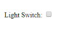
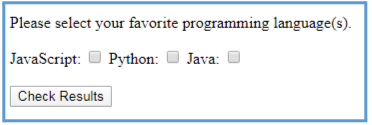
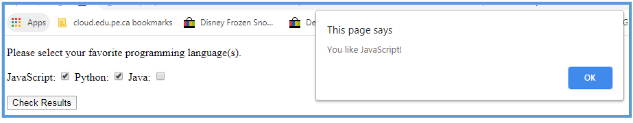
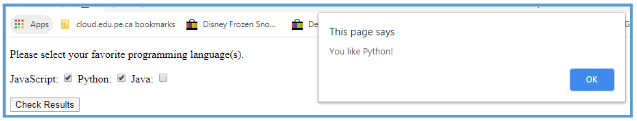
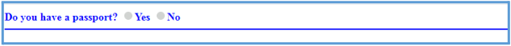
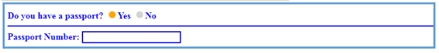
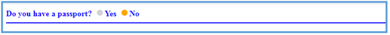

## Chapter 10. Checkboxes and Radio Buttons

Resources: https://developer.mozilla.org/en-US/docs/Web/HTML/Element/input/checkbox | https://developer.mozilla.org/en-US/docs/Web/HTML/Element/input/radio

## Checkboxes

Checkboxes use the `.checked` property.
- If `.checked` is `true`, the checkbox is checked.
- If `.checked` is `false`, the checkbox is not checked.

#### Example: [check1.html](check1.html)
This example checks and unchecks a checkbox using two buttons.

```html
<!DOCTYPE html>
<html lang="en" dir="ltr">
  <head>
    <meta charset="utf-8" />
    <title>Checkbox Example 1</title>
    <script>
      function check() {
        document.querySelector(".myCheck").checked = true;
      }
      function uncheck() {
        document.querySelector(".myCheck").checked = false;
      }
    </script>
  </head>
  <body>
    Checkbox: <input type="checkbox" class="myCheck" name="" value="" />
    <button type="button" name="button" onClick="check()">
      Check Checkbox
    </button>
    <button type="button" name="button" onClick="uncheck()">
      Uncheck Checkbox
    </button>
  </body>
</html>
```

#### Example: [check2.html](check2.html)
This example reads whether the checkbox is checked and displays the result.

```html
<!DOCTYPE html>
<html lang="en" dir="ltr">
  <head>
    <meta charset="utf-8" />
    <title>Checkbox Example 2</title>
    <script>
      function check() {
        let isChecked = document.querySelector(".myCheck").checked;
        if (isChecked == true) {
          document.querySelector(".demo").textContent =
            isChecked + " so CheckBox is checked";
        } else {
          document.querySelector(".demo").textContent =
            isChecked + " so CheckBox is NOT checked";
        }
      }
    </script>
  </head>
  <body>
    Checkbox: <input type="checkbox" class="myCheck" name="" value="" />
    <button type="button" name="button" onClick="check()">Try It</button>
    <p>
      Click the "Try It" button to find out whether the checkbox is checked, or
      not.
    </p>
    <p class="demo"></p>
  </body>
</html>
```

#### Example: [check3.html](check3.html)
This example shows or hides text based on a checkbox state.

Output reference image: 

```html
<!DOCTYPE html>
<html lang="en" dir="ltr">
  <head>
    <meta charset="utf-8" />
    <title>Checkbox Example 3</title>
    <script>
      function check() {
        if (document.querySelector(".chkbox").checked == true) {
          document.querySelector(".text").style.display = "block";
        } else {
          document.querySelector(".text").style.display = "none";
        }
      }
    </script>
    <style>
      .text {
        display: none;
      }
    </style>
  </head>
  <body>
    Checkbox:
    <input type="checkbox" class="chkbox" onClick="check()" name="" value="" />
    <p>This program displays some text when a checkbox is checked.</p>
    <p class="text">Checkbox is CHECKED!</p>
  </body>
</html>
```

#### Example: [check4.html](check4.html)
This program simulates a light switch. The page is white when unchecked and black when checked.

Initial screen reference: 

Checked screen reference: 

```html
<!DOCTYPE html>
<html lang="en" dir="ltr">
  <head>
    <meta charset="utf-8" />
    <title>Checkbox Example 4</title>
    <script>
      function lights() {
        // need code here
      }
    </script>
  </head>
  <body>
    <form>
      Light Switch:
      <input
        type="checkbox"
        id="lightChkBox"
        onClick="lights()"
        name=""
        value=""
      />
    </form>
  </body>
</html>
```

---

<h4 style="background-color: yellow;"> Task 10.1: Checkbox Problem </h4>

Starter File: [CheckBoxProblem.html](CheckBoxProblem.html)

Create a program that looks like this in the browser:



When the user chooses their favorite programming language(s), show alert(s) telling them which languages they like.

Example outputs:
- 
- 

Note: Adding a Reset button with type `reset` allows the user to uncheck all checkboxes.

## Radio Buttons

Radio buttons in the same group must share the same `name` attribute.

This makes them mutually exclusive: when one is selected, the others are unselected.

### Radio Button 1: Trigger event on Click

When you click a radio button, code like `onclick="choice(this.value)"` can pass the selected value into a function.

Example:

```html
<input
  type="radio"
  onclick="choice(this.value)"
  name="browser"
  value="Firefox"
/>Firefox<br />
```

#### Use Case: 
1. You want instant reaction as soon as the student clicks an option.
2. You only care about the one radio that triggered the event.
3. You want very simple beginner-friendly event flow.
4. You are building UI behavior like live preview, live label updates, or immediate filtering.

#### Challenges: 
1. Logic is partly attached to each HTML element, so behavior is spread across markup.
2. Harder to reuse across larger apps where separation of HTML and JS is preferred.

#### Example: [radio1.html](radio1.html)

```html
<!DOCTYPE html>
<html lang="en" dir="ltr">
  <head>
    <meta charset="utf-8" />
    <title>Radio Button Example</title>
    <script>
      function choice(davalue) {
        document.querySelector(".dachoice").value = davalue;
      }
    </script>
    <style>
      p {
        font-weight: 900;
        color: #0000ff;
        text-transform: uppercase;
        font-size: 18px;
      }
      .dachoice {
        font-weight: 600;
        color: #0000ff;
        font-size: 14px;
      }
      .dacolor {
        font-size: 18px;
        color: red;
        font-weight: 500;
      }
    </style>
  </head>
  <body>
    <p>Please choose your favorite browser.</p>
    <form>
      <input
        type="radio"
        onclick="choice(this.value)"
        name="browser"
        value="Firefox"
      /><span class="dacolor">Firefox</span><br />
      <input
        type="radio"
        onclick="choice(this.value)"
        name="browser"
        value="Chrome"
      /><span class="dacolor">Chrome</span><br />
      <input
        type="radio"
        onclick="choice(this.value)"
        name="browser"
        value="Safari"
      /><span class="dacolor">Safari</span><br /><br />
      <input type="text" name="" class="dachoice" value="" />
    </form>
  </body>
</html>
```


#### Radio Buttons 2: Function to Determine which radio button is selected
A separate button triggers one function, and that function queries the DOM to find which radio is selected.

#### Use cases:
1. You want users to make a choice first, then explicitly submit/confirm.
2. You need to validate multiple inputs at once before continuing.
3. You want cleaner separation: HTML for structure, JS for logic.
4. Form logic and event flow is more complex, so having a single entry point in JS is easier to manage.

#### Challenges:
User does not get immediate feedback unless they press the button.

#### Example: [radio2.html](radio2.html)

```html
<!DOCTYPE html>
<html lang="en" dir="ltr">
  <head>
    <meta charset="utf-8" />
    <title>Radio Button Selected Value Example</title>
    <script>
      function showSelected() {
        let selected = document.querySelector('input[name="browserChoice"]:checked');

        if (selected) {
          document.querySelector('.result').textContent =
            'Selected browser: ' + selected.value;
        } else {
          document.querySelector('.result').textContent =
            'No browser selected yet.';
        }
      }
    </script>
  </head>
  <body>
    <p>Choose one browser, then click the button:</p>

    <input type="radio" name="browserChoice" value="Firefox" />Firefox<br />
    <input type="radio" name="browserChoice" value="Chrome" />Chrome<br />
    <input type="radio" name="browserChoice" value="Safari" />Safari<br /><br />

    <button type="button" onclick="showSelected()">Show Selected</button>
    <p class="result"></p>
  </body>
</html>
```

---

<h4 style="background-color: yellow;"> Task 10.2: Radio Passport Problem </h4>

Starter File: [RadioPassportProblem.html](RadioPassportProblem.html)

Create a program that looks like this when it first loads:



When the user clicks the Yes radio button, this appears:



If the user clicks the No radio button, the objects below the horizontal line disappear again:



Requirements:
1. All text should be blue.
2. Yes and No text in the radio buttons should be blue.
3. The horizontal line should be blue.
4. The text box should be blue.

Notes:
1. To make a radio button checked by default, add `checked` in the HTML.

```html
<input
  type="radio"
  onclick="choice(this.value)"
  name="passport"
  value="No"
  checked
/>
```

2. You can create a CSS class for blue text and blue border, then assign it to each relevant element.

```css
.colour {
  font-size: 15px;
  color: blue;
  font-weight: bold;
  border-color: blue;
}
```
