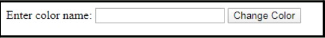
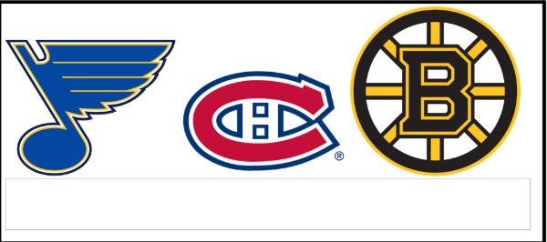
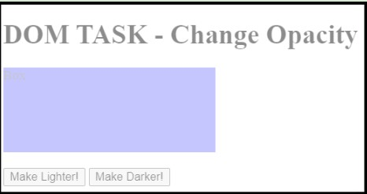

## Chapter 8. More Practice with DOM, Functions and Event Listeners

Resources: https://www.w3schools.com/html/html_form_input_types.asp | https://developer.mozilla.org/en-US/docs/Learn_web_development/Core/Scripting/Events

#### Remember: How to create a text input box

```html
<input type="text" class="fname" name="fname">
```

There are numerous types for the input element. See: https://www.w3schools.com/html/html_form_input_types.asp

#### Remember: How to access the value in an input box

```javascript
document.querySelector('selector').value
```

---

<h4 style="background-color: yellow;"> Task 8.A: Colour Picker </h4>

Starter Code: [T8A_Color_Picker.html](T8A_Color_Picker.html)





Create a page with text, an input box, and a button.
Have the user type in a colour (e.g. red, blue). When the user clicks the Change Color button, the background colour of the webpage will change to that colour.

---

#### Mouse Events and adding Event Listeners directly in HTML

You can attach mouse events directly in HTML using `onMouseOver` and `onMouseOut`.

```html
<h1 onMouseOver="style.color='red';" onMouseOut="style.color='black';">Mouse Event</h1>
```

#### Add event listeners in JavaScript

```javascript
document.querySelector("selector").addEventListener( "event" , function_name )
```

---

<h4 style="background-color: yellow;"> Task 8.B: Team Name </h4>

Starter Code: [T8B_Team_Name.html](T8B_Team_Name.html)




Create a page with three team logo images (similar in size) and one input box below them.
- When the user hovers over a team logo, the name of the team should appear in the text box.
- When the user moves the mouse off the image, the text box should go blank.
- When the user moves the mouse over a different image, that team's name should appear.

---

<h4 style="background-color: yellow;"> Task 8.C: Change Opacity </h4>

Starter Code: [T8C_Change_Opacity.html](T8C_Change_Opacity.html)




Complete the code so that the Lighter and Darker buttons change the opacity of the div box.

#### Remove event listeners

```javascript
document.querySelector("selector").removeEventListener( "event" , function_name )
```

Only events that have been ADDED with `addEventListener` can be removed using `removeEventListener`.

---

<h4 style="background-color: yellow;"> Task 8.D: Remove Listener </h4>

Starter Code: [T8D_Remove_Listener.html](T8D_Remove_Listener.html)

Complete the code so that after the button is pressed, the random number stops changing.
