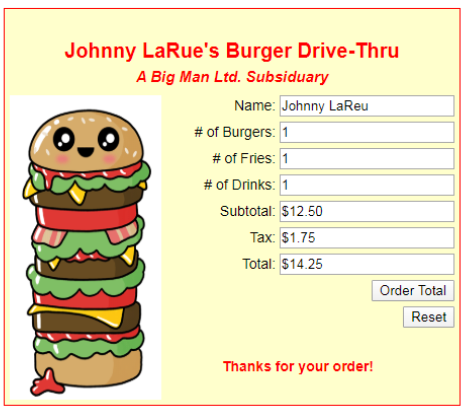
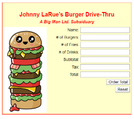

# CMP621A - JavaScript  - Burger Form 



## Creating a Form
```html
<form class = "right" class = "orderform" name = "orderform">
```

## Creating an Input Field
```html
<div class = "field">   Name: <input type="text" class="name" name="" value=""> </div>
```

## Creating a Button
```html
<div class = "field">   <button class="button" type = "button">Order Total </button> </div>
```

## A RESET button type
```html
<div class = "field">   <button class="button" type = "reset">Reset </button> </div>
```

When you use a button with type **“RESET”** in your html FORM, the reset button will automatically reset the values of the inputs within the form.


## Some CSS Suggestions
```css
body {
  font: 14px arial;
  text-align: center;
}
.wrapper {
  margin: 0 auto; /* center it all on the page*/
  width: 440px; /* set width of order form */
}
```

```css
.heading {
  font: 20px arial;
  font-weight: bold;
  margin-bottom: 5px;
  margin-top: 25px;
}
```

```css
.field {
  margin-bottom: 5px;
  text-align: right;
}
```

* Use a **flexbox** to put the image and the order form side by side in the container.

## HTML Setup
* Make sure that you have a wrapper in the body of the webpage that you can style with the css code above.  Everything on the page will be inside the wrapper container.  We are going to use this wrapper to center everything on our web page.

* Create a form for the page.  Put each individual form object inside a container called field.  This must be done for each and every object on the form.

* Make sure that you use an unique class attribute for each object on the form.  You will need this to identify each object when you do your JavaScript calculations etc. 

* You are going to make three fields in the form **readonly** fields.  Do a google search to find out how to make an input text box a **readonly** text box.  Apply this code to the subtotal, tax, and total input fields.  We don't want the user to be able to change the information in these fields.  If we make them **readonly**, the user cannot change this information.

* You are going to create a button on the form just below all the text boxes.  You will use this button to calculate the subtotal, tax and total amount for each order.

* You are going to add an **onchange** (or _oninput_) event to the # of Drinks text box.  When the user enters something in this box and then clicks on another box, the onchange event will call the JavaScript function that performs all of our calculations and displays the results in the appropriate output text boxes.  This will be the exact same function as the one that is called or invoked when we click on the Order Total button.  Google for some information about the onchange event.  You will find that it is very simple to use!

## JavaScript Setup
* Create a function to capture the input from each required text box, process appropriate calculations, and display the proper information in the required fields on the form.  Here are some hints:
** Use Constants for any costs or other values that are always the same in your calculations

* When the user types in a number less than zero, (i.e. # of Burgers: -1) the program should reset the value of the burgers to zero.  This should also be done for # of Fries and # of Drinks.

* When the user types in anything other than a number in the # of Burgers, # of Fries or # of Drinks field, the value of that field should be set to zero.

* Try to write your reset button using minimal amount of JS code. You should have a maximum of two lines of code in the function that clears the fields in the form.  These two lines of code will clear the thank you message and all the fields.

#### Burger Form After Reset



  